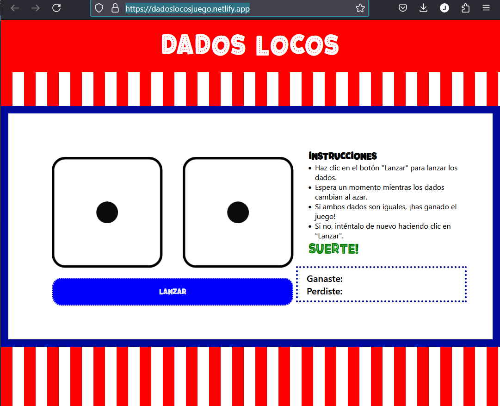

# Dados Locos



**Dados Locos** es un juego interactivo donde el usuario puede lanzar dos dados virtuales y ver si obtiene una combinación ganadora. El objetivo es simple: ¡si ambos dados muestran el mismo número, ganas! En caso contrario, puedes seguir jugando lanzando los dados nuevamente. La aplicación genera dos números aleatorios entre 1 y 6, los cuales simulan el lanzamiento de dados, y muestra las imágenes correspondientes.

Para jugar, el usuario solo necesita hacer clic en el botón **Lanzar**, lo que hará que los dados se actualicen aleatoriamente. Si ambos dados muestran el mismo número, el juego muestra un mensaje indicando que el usuario ha ganado, y si no, se le invita a intentarlo de nuevo.

La aplicación también lleva un registro de cuántas veces el usuario ha ganado y cuántas veces ha perdido, mostrando los contadores de victorias y derrotas en la interfaz.

## Características

- **Generación aleatoria de números**: La función `aleatorio()` genera números aleatorios entre 1 y 6, simulando el lanzamiento de dos dados.
- **Interfaz dinámica**: Los dados se actualizan con nuevas imágenes cada vez que el usuario hace clic en el botón **Lanzar**.
- **Contadores de victorias y derrotas**: Los resultados del juego (si se gana o pierde) se almacenan y se muestran en tiempo real, manteniendo un registro de cuántas veces el jugador ha ganado o perdido.

## Lógica del Programa

La aplicación utiliza la función `aleatorio()` para generar números aleatorios entre 1 y 6, simulando el lanzamiento de dados. Cada vez que el usuario hace clic en el botón **Lanzar**, se ejecuta el siguiente flujo:

1. **Generación de números aleatorios**: Se generan dos números aleatorios entre 1 y 6, cada uno representando el valor de un dado.
2. **Actualización de las imágenes de los dados**: Las imágenes de los dados se actualizan según los números generados.
3. **Condición de victoria**: Si ambos dados tienen el mismo número, el mensaje en pantalla muestra "GANASTE!!!" y el contador de victorias se incrementa.
4. **Condición de derrota**: Si los dados no coinciden, el mensaje en pantalla muestra "PERDISTE!!!" y el contador de derrotas se incrementa.

### Tecnologías

- **HTML5**: Estructura básica de la página web.
- **CSS3**: Estilos y diseño de la interfaz.
- **JavaScript**: Lógica para generar números aleatorios y manejar los eventos del juego.
- **FontFace**: Para importar una fuente personalizada.

### Deploy

Visita la web: https://dadoslocosjuego.netlify.app/ y diviertete!

### Estructura del Proyecto

```
/dadosLocos
├── /images               # Contiene las imágenes de los dados
├── /src/fonts            # Fuente personalizada
├── /styles               # Archivos CSS
│   └── styles.css        # Estilos principales
│   └── responsive.css    # Estilos responsive
├── /scripts              # Archivos JavaScript
│   └── script.js         # Lógica del juego
├── index.html            # Página principal
└── README.md             # Documentación del proyecto
```

### Contribuciones

Si quieres contribuir al proyecto, por favor haz un fork y abre un pull request. Asegúrate de que tus cambios no rompan la funcionalidad del juego y que el código siga las convenciones de estilo.